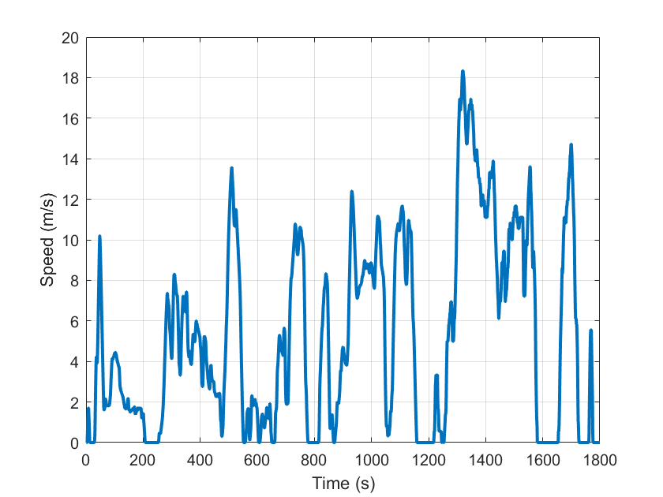
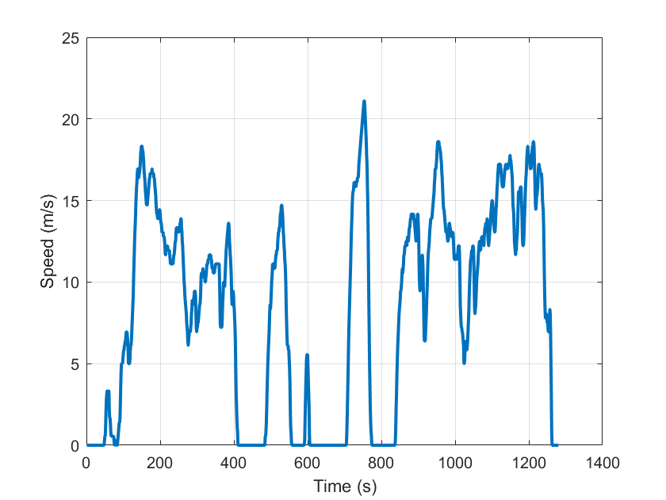
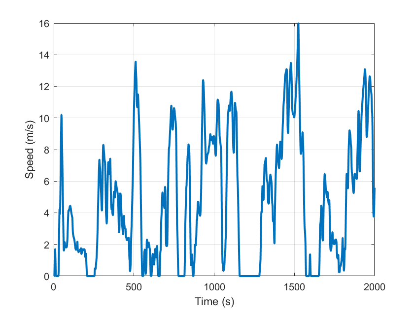
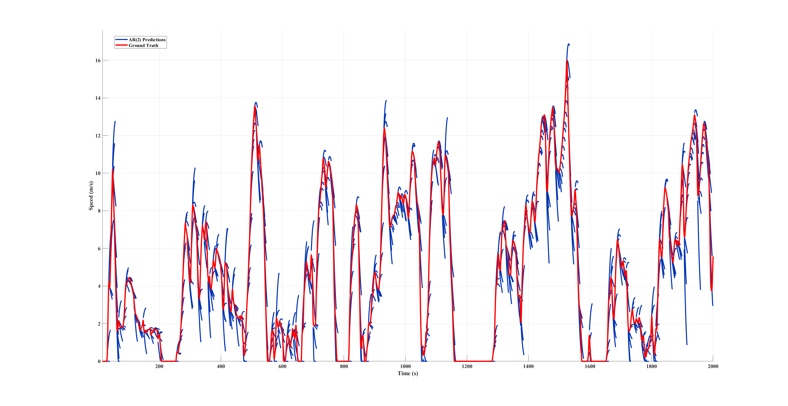
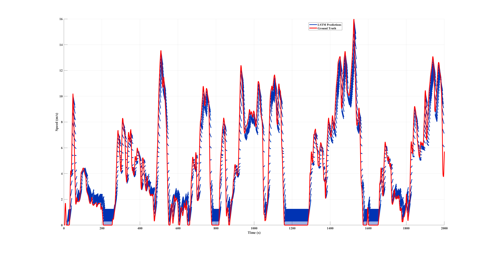

# Speed-prediction-using-LSTM


[](https://opensource.org/licenses/MIT)
[](https://www.python.org/downloads/)

supply materials for TIE paper

## 📝 How to run?
Unlike projects that use a requirements.txt file, this project utilizes [Poetry](https://python-poetry.org/) for environment management. 
To run the project, please ensure Poetry is installed and execute the following command in terminal:
```
poetry install # to install all the dependencies.
poetry run python multi_driving_cycles_process.py
```
## 🚀 What is included?
For detailed implementation, including hyperparameters and the training pipeline, please refer to multi_driving_cycles_process.py

The driving cycle used in the simulation, whose name is  dataset/Merged_real_cycle.mat is:


It is derived from two driving cycles, which is :

First, dataset/Guiyang_city.mat, from 1 s - 600 s



Second, dataset/real_drive_cycle6.mat, from 1 s - 1200 s




Speed prediction trajectories

Through AR model:


Through LSTM model:

